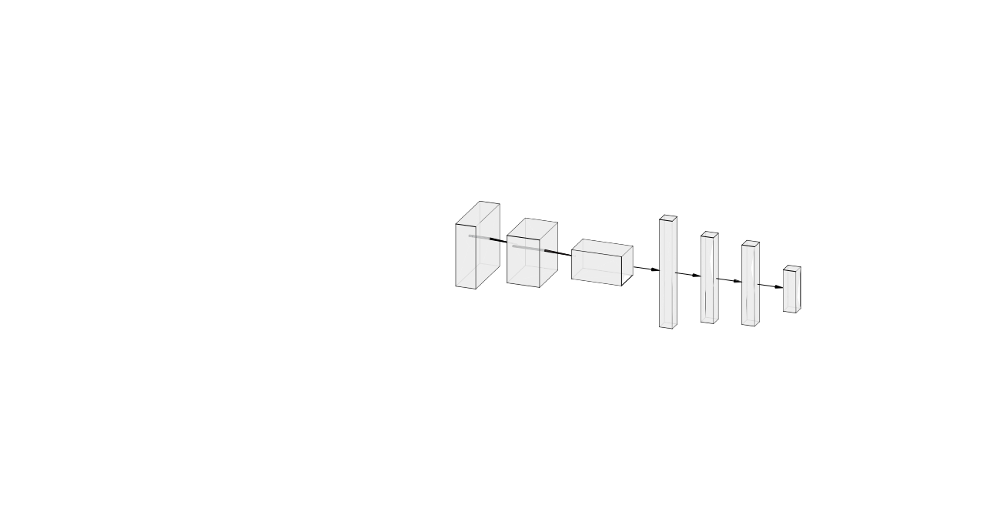
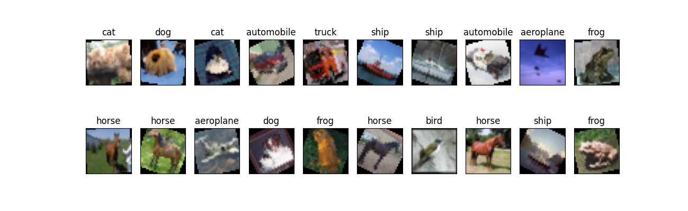

# CIFAR10 Image Classifier 

This project focuses on classifying CIFAR images using Convolutional Neural Networks (CNNs). The architecture of the CNN used is illustrated below:



Here is a sample batch of training dataset images for reference:



The trained model has been saved as `model_cifar.pt`.

While the current architecture is not exceptionally deep, it achieves an approximate overall accuracy of 63%. To enhance the accuracy, consider increasing the depth of the convolutional layers and extending the training duration.

The current accuracy per class is as follows:

```
Test Accuracy of aeroplane: 62% (629/1000)
Test Accuracy of automobile: 71% (716/1000)
Test Accuracy of  bird: 51% (518/1000)
Test Accuracy of   cat: 47% (473/1000)
Test Accuracy of  deer: 59% (599/1000)
Test Accuracy of   dog: 46% (463/1000)
Test Accuracy of  frog: 72% (724/1000)
Test Accuracy of horse: 68% (686/1000)
Test Accuracy of  ship: 83% (834/1000)
Test Accuracy of truck: 74% (747/1000)

Test Accuracy (Overall): 63% (6389/10000)
```