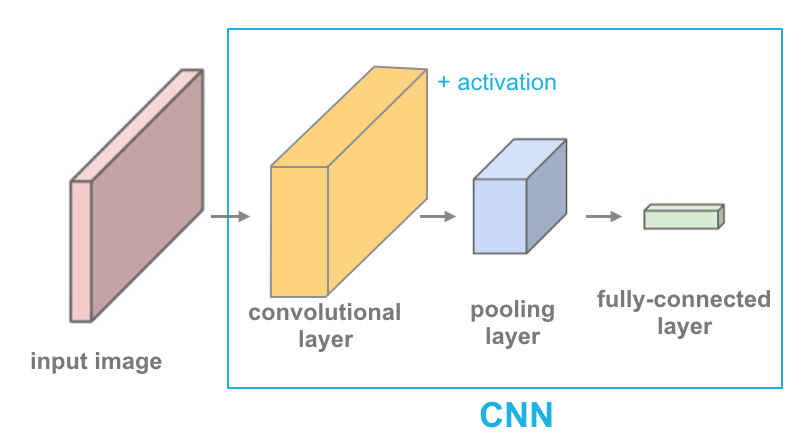

# Visualization of Convolutional layer (Forward only)

In this project, a simple forward convolutional neural network is created, and the layers are visualized. A convolutional layer + activation function, followed by a pooling layer, and a linear layer (to create a desired output size) make up the basic layers of a CNN.

The input image is follows:

The grayscale of the above image is used. The kernals (or filters) that we are applying are:

After applying 4 simple kernals, we will receive the following layers as output:

