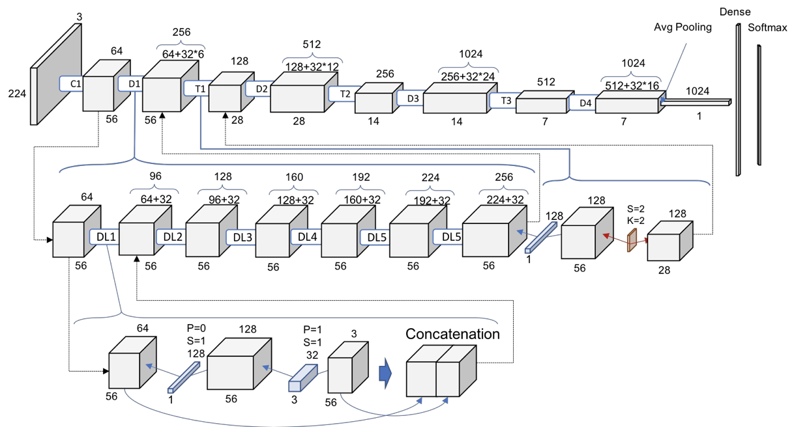

# Dog vs. Cat Classification with PyTorch (using Transfer Learning)

This is a simple Dog vs. Cat classification project. The dataset we utilize is sourced from a Kaggle competition that challenged participants to create an algorithm capable of identifying dogs and cats from images. You can download the dataset from [this link](https://www.kaggle.com/competitions/dogs-vs-cats/data?select=train.zip) and unzip it. To set up the project, run the `rename.py` script, which will rename and organize the training dataset under the "data" folder. 

### Multi-Layer Perceptron (MLP) Classifier

While multi-layer perceptrons (MLPs) have performed well in previous scenarios, such as the [MNIST Classifier](https://github.com/HariPrasanth-SM/PyTorch-exercises/tree/main/mnist_mlp_classifier) and [FashionMNIST Classifier](https://github.com/HariPrasanth-SM/PyTorch-exercises/tree/main/fashion_mnist_classifier), they are not the most optimal choice for this dog vs. cat classification task. The main challenge lies in the input data, which consists of RGB images with varying sizes, unlike the grayscale, 28x28 images in the previous cases. In the `mlp_classifier.py` code, we attempted to use an MLP classifier by resizing all images to 224x224 pixels. However, training this model without GPU acceleration can be incredibly time-consuming, and even with sufficient training time, the performance remains suboptimal. 

### Transfer Learning with DenseNet121

To tackle this real-world scenario effectively, we turn to Convolutional Neural Networks (CNNs). In this project, we leverage the power of "Transfer Learning." Instead of training a CNN from scratch, we opt for a pretrained network with pre-existing weights and adapt its classifier to suit our specific needs before retraining it. For this task, we have chosen the "DenseNet121" architecture from `torchvision.models`. We have replaced the classifier to make it suitable for our dog vs. cat classification needs and trained the model accordingly. The architecture of DenseNet121 is depicted in the image below:

Although DenseNet121 might not achieve extremely high accuracy, it significantly outperforms the MLP approach, making it a more suitable choice for this challenging classification task.
