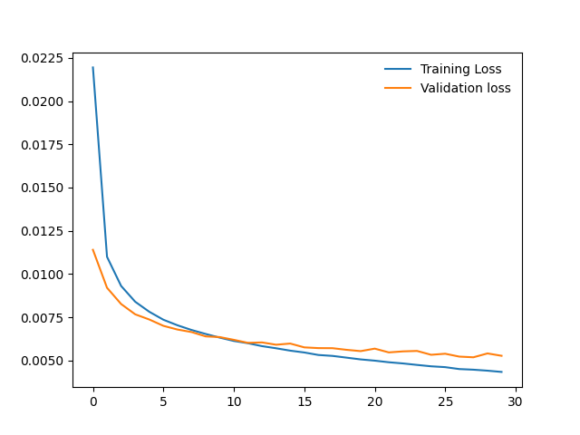
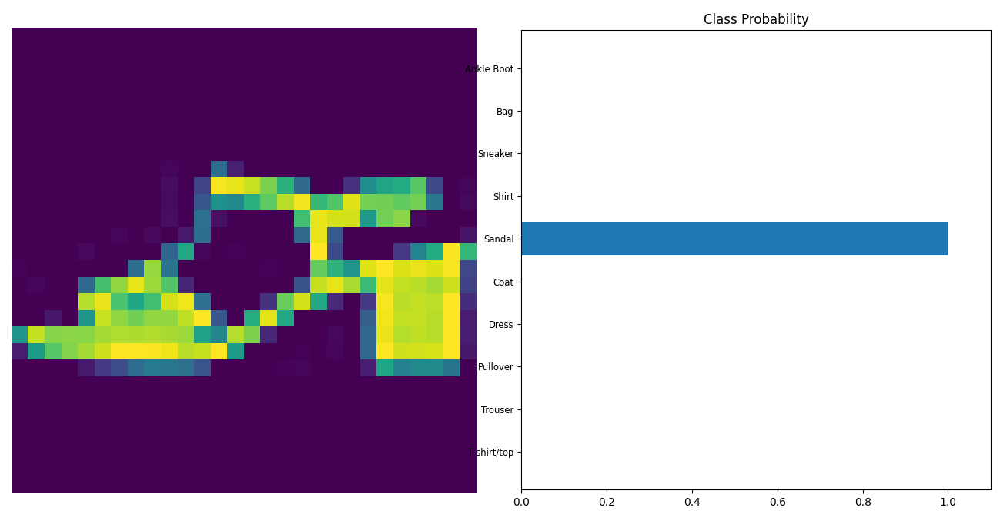

# PyTorch FashionMNIST Classifier

This repository contains a simple PyTorch project for training and evaluating a classifier on the FashionMNIST dataset, which is similar to my another project on [MNIST dataset](https://github.com/HariPrasanth-SM/PyTorch-exercises/tree/c2da4012e13ce62e7f7555c9422ae37f77d25a97/mnist_mlp_classifier). The code provided here demonstrates the complete process of loading the data, building a neural network, training the model, and visualizing the training progress. Additionally, it includes code for saving the trained model and testing it on a sample image.

### Training loss vs Validation loss

The training loss and validation loss comparision is plotted, and we will get a plot similar to the following one:

### Saving the Model

After training, the model is saved for future reference. The model's architecture and learned parameters are saved in a checkpoint file named `checkpoint.pth`. 

### Testing the model

After the model is trained, we are testing it with a sample image to predict it's class, use the provided `view_classification` function in `helper.py`. 

