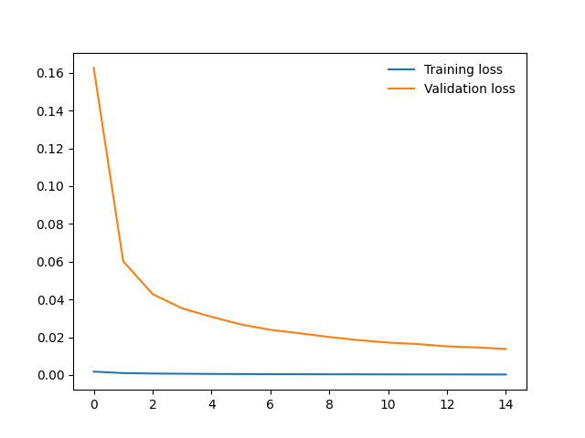
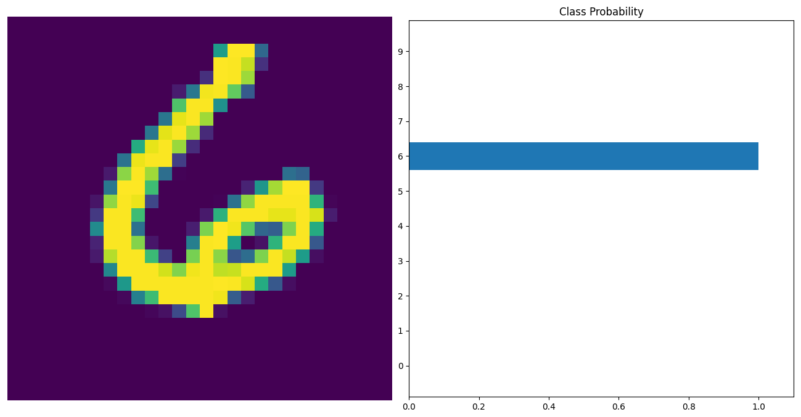

# PyTorch MNIST Classifier

This repository contains a simple PyTorch project for training and evaluating a classifier on the MNIST dataset. The code provided here demonstrates the complete process of loading the data, building a neural network, training the model, and visualizing the training progress. Additionally, it includes code for saving the trained model and testing it on a sample image.

### Introduction

In this project, we implement a simple Multi-Layer Perceptron (MLP) classifier using PyTorch to classify handwritten digits from the MNIST dataset. This example serves as a starting point for deep learning practitioners and enthusiasts.

### Setup

Before you can run the code, make sure you have the necessary Python packages installed. You can do this using `pip`:

```bash
pip install torch torchvision matplotlib
```

### Training

The training process includes the following steps:

1. Data preprocessing: The MNIST data is loaded and normalized.

2. Model definition: The MLP model, defined in the `network.py` file, is created.

3. Loss function: We use the Negative Log-Likelihood Loss (NLLLoss) for training.

4. Optimization: Stochastic Gradient Descent (SGD) is employed as the optimization algorithm with a learning rate of 0.01.

5. Training loop: The model is trained for a specified number of epochs (30 in this case), and training and validation loss values are recorded.

### Validation

The validation process involves evaluating the trained model on the test data:

1. The model is set to evaluation mode.

2. Test data is processed to compute the loss and accuracy.

The training loss and validation loss comparision is plotted, and we will get a plot similar to the following one:



### Saving the Model

After training, the model is saved for future reference. The model's architecture and learned parameters are saved in a checkpoint file named `checkpoint.pth`. We use this saved model in the `load_checkpoint.py` to test it.

### Viewing Classification Results

After the model is trained, we are testing it with a sample image to predict it's class, use the provided `view_classification` function in `helper.py`. 

